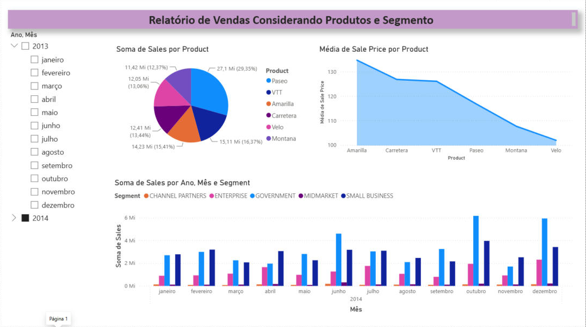
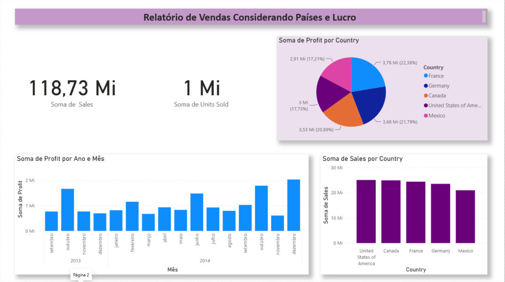
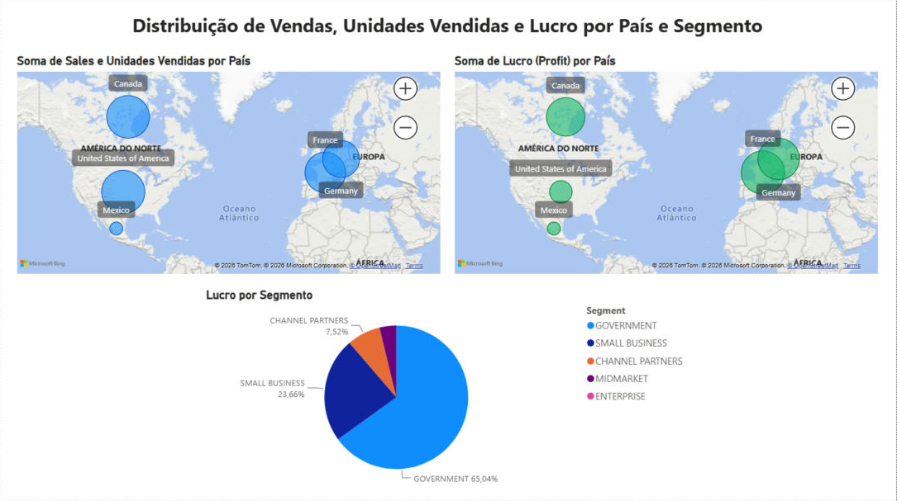

# 📊 Desafio de Projeto DIO — Relatório Financeiro com Power BI

Projeto desenvolvido para o **Desafio de Projeto** do bootcamp de **Power BI** da [DIO](https://www.dio.me/), no módulo *Primeiros passos com Power BI*.

O objetivo é construir um relatório no **Power BI Desktop** a partir da base de exemplo **Financial Sample** da Microsoft, criando páginas com visuais que respondam perguntas de negócio sobre vendas, unidades vendidas e lucro.

---

## 🗂️ Arquivos do repositório

| Arquivo | Descrição |
|---|---|
| `sample_financial_desafio.pbix` | Relatório do Power BI com as 3 páginas do projeto |
| `Financial Sample.xlsx` | Base de dados utilizada (planilha de exemplo da Microsoft) |
| `imagens/` | Prints das 3 páginas do relatório |

---

## 📁 Sobre os dados

A base **Financial Sample** tem **700 registros** de vendas de 2013 e 2014, com as colunas:

`Segment`, `Country`, `Product`, `Discount Band`, `Units Sold`, `Manufacturing Price`, `Sale Price`, `Gross Sales`, `Discounts`, `Sales`, `COGS`, `Profit`, `Date`, `Month Number`, `Month Name` e `Year`.

Números gerais da base:

- **Vendas (Sales):** ~118,73 milhões
- **Unidades vendidas:** ~1,13 milhão
- **Lucro (Profit):** ~16,89 milhões

---

## 🛠️ O que foi feito

1. **Importação dos dados** — a planilha `Financial Sample.xlsx` foi carregada no Power BI Desktop pela opção *Obter dados → Pasta de trabalho do Excel*, usando a tabela `financials`.
2. **Conferência dos tipos de dados** no Power Query (números, datas e textos).
3. **Criação das páginas do relatório**, cada uma com um foco de análise:

### Página 1 — Vendas considerando produtos e segmento
- **Segmentação de dados** (slicer) por Ano e Mês para filtrar a página
- **Pizza** com a soma de vendas (Sales) por produto
- **Área** com a média do preço de venda (Sale Price) por produto
- **Colunas clusterizadas** com a soma de vendas por ano, mês e segmento

### Página 2 — Vendas considerando países e lucro
- **Cartões** com o total de vendas (118,73 mi) e de unidades vendidas (~1 mi)
- **Pizza** com a soma de lucro por país
- **Colunas** com a soma de lucro por ano e mês
- **Colunas** com a soma de vendas por país

### Página 3 — Distribuição por país e segmento *(foco deste desafio)*
- 🗺️ **Mapa 1 — Soma de Sales e Unidades Vendidas por País**: o tamanho da bolha representa o total de vendas e a dica de ferramenta mostra as unidades vendidas.
- 🗺️ **Mapa 2 — Soma de Lucro (Profit) por País**: o tamanho da bolha representa o lucro total de cada país.
- 🥧 **Pizza — Lucro por Segmento**: participação de cada segmento no lucro (Government 65,04%, Small Business 23,66%, Channel Partners 7,52%).

---

## 🔎 Principais insights

**Por país**

| País | Vendas (Sales) | Unidades vendidas | Lucro (Profit) |
|---|---:|---:|---:|
| Estados Unidos | 25,03 mi | 232.628 | 3,00 mi |
| Canadá | 24,89 mi | 247.428 | 3,53 mi |
| França | 24,35 mi | 240.931 | 3,78 mi |
| Alemanha | 23,51 mi | 201.494 | 3,68 mi |
| México | 20,95 mi | 203.325 | 2,91 mi |

- Os **Estados Unidos** lideram em vendas, mas a **França** é o país com **maior lucro**.
- O **Canadá** é o país com mais **unidades vendidas**.
- O **México** fica em último tanto em vendas quanto em lucro.

**Por segmento**

- O segmento **Government** concentra a maior parte do lucro (~11,39 mi), seguido de **Small Business** (~4,14 mi).
- **Channel Partners** (~1,32 mi) e **Midmarket** (~0,66 mi) têm participação menor.
- O segmento **Enterprise** teve **lucro negativo** (~-0,61 mi), ou seja, prejuízo no período. Por isso ele não aparece como fatia no gráfico de pizza (o Power BI não desenha fatias negativas).

---

## 🧰 Tecnologias

- Power BI Desktop
- Power Query
- Microsoft Excel (fonte de dados)

---

Feito por **Felipe** como parte do bootcamp da [DIO](https://www.dio.me/). 🚀
